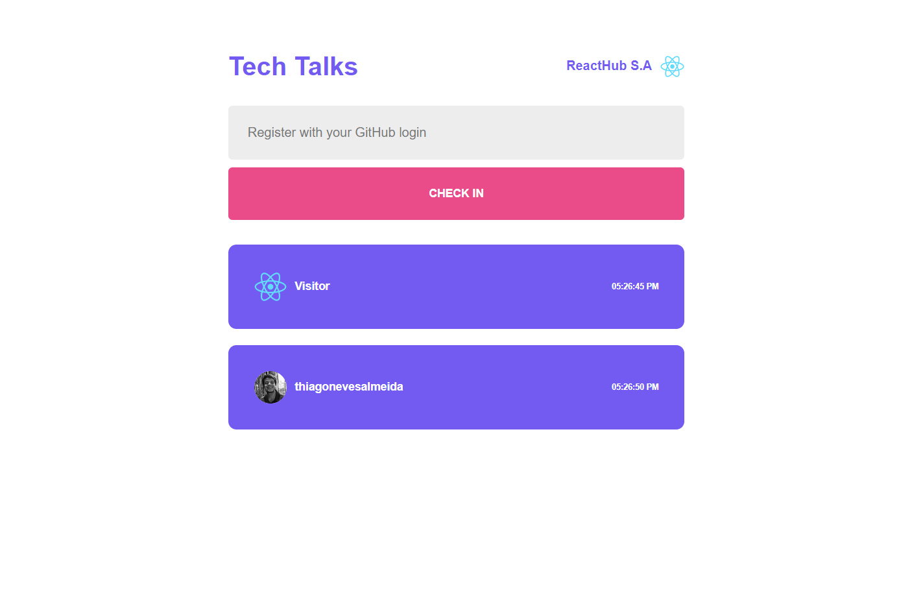

<h1 align="center">Tech Talks</h1>

React project to develop a "Tech Talks" event check-in application that allows users to register with their GitHub information 🚀

    <a href="#-technologies">Technologies</a>&nbsp;&nbsp;&nbsp;|&nbsp;&nbsp;&nbsp;
    <a href="#-project">Projet</a>&nbsp;&nbsp;&nbsp;|&nbsp;&nbsp;&nbsp;
    <a href="#-license">License</a>&nbsp;&nbsp;&nbsp;|&nbsp;&nbsp;&nbsp;
    <a href="#-contact">Contact</a>&nbsp;&nbsp;&nbsp;|&nbsp;&nbsp;&nbsp;
    <a href="#-contact">Documentation</a>

 

  

 

  

## 🚀 Technologies

Esse projeto foi desenvolvido com as seguintes tecnologias:

- React
- Vite (Next.js replacement - in development)
- React Hook {useState}
- Node/NPM
- API Rest (GitHub)
- Fetch API
- HTML and CSS
- JSX
- ES6 modules
- Git & GitHub

## 💻 Projeto

React project to create a "Tech Talks" Event application that allows users to check-in with their GitHub login, while fetch their profile information, and display it in a card format using React component-Based Architecture.
 
You can access the project online through [THIS LINK](https://thiagonevesalmeida.github.io/react-talks/) 🚀.

## 📝 Licença

Esse projeto está sob a licença MIT.

## 📨 Contato

thiagonevesdealmeida@gmail.com

[linkedin.com/in/thiagonevesdealmeida](https://www.linkedin.com/in/thiagonevesdealmeida/) 

# Documentation

## React Documentation

This documentation provides an overview of the React code created with the Vite boilerplate.

## Components

- Home: The main component responsible for rendering the Tech Talks application UI.

- Card : A component that displays user infromation in the application.

## State

- newGuest: An array state variable that holds the information of registered users. Each Guest is represented by an object containing their name and avatar image from GitHub API, followed by there registration chek-in time.

## File Structure

- index.html: The HTML template file that serves as the entry point for the application. It includes a 
 element with an ID of root where the React application is rendered.

- main.jsx: The entry file that initializes the React application and renders the Home component into the root element.

- index.jsx: The main component file that renders the Home and Card components.

## Dependencies

- react: The React library for building user interfaces.
- react-dom: The React DOM library for rendering React components in the browser.

## Build and Development Scripts

- "npm run dev": Starts the development server using Vite and opens the application in the browser. It provides live reloading and displays any lint errors in the console.

- "npm run build": Builds the project using Vite's build command.

- "npm run lint": Runs ESLint to lint the source code files with the extensions .js and .jsx.

- "npm run serve": Serves the production build from the dist folder using a local server.

- "npm run preview": Launches a preview server to preview the production build of the project using Vite.

## Development Workflow

1) The index.html file serves as the entry point, which includes the root element where the React application is rendered.

2) The main.jsx file initializes the React application by rendering the App component into the root element.

3) The index.jsx are the component that renders the elements for the application content.

4) During development, running the "npm run dev" script starts the development server and automatically opens the application in the browser. Any changes made to the code trigger a live reload, allowing for a smooth development experience.

5) When ready to deploy the application, running the "npm run build" script generates a production-ready build in the dist folder. The optimized code can then be served using a local server by running the "npm run serve" script.

